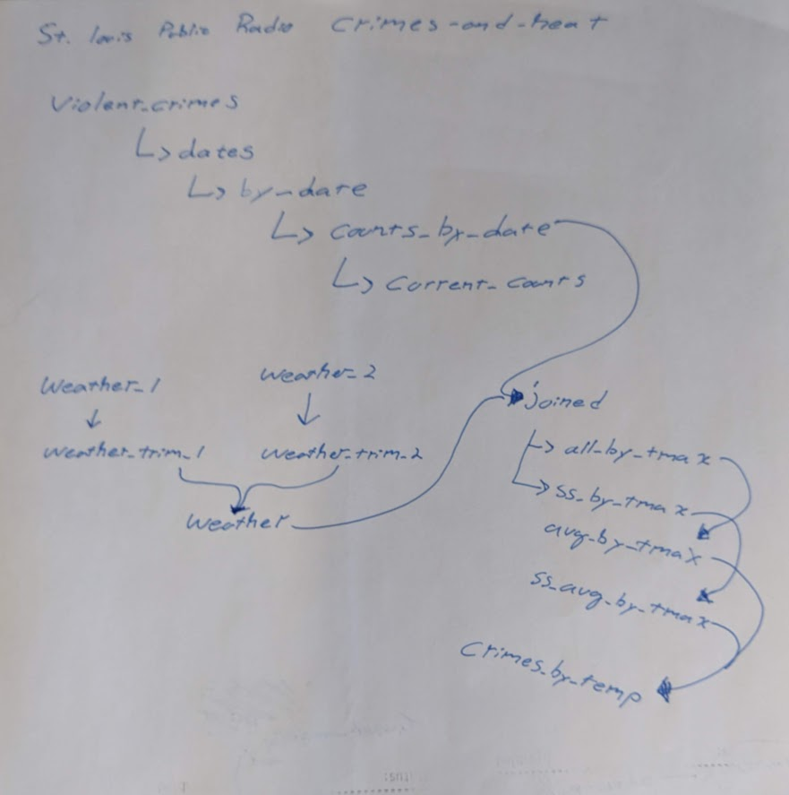

# 2018-05-31-crime-and-heat-analysis

This is a basic analysis of crime and temperature for the story [Warm weather worries in St. Louis: When temperatures rise, crime often follows
](http://news.stlpublicradio.org/post/warm-weather-worries-st-louis-when-temperatures-rise-crime-often-follows).

See the [python notebook](crimes-and-heat.ipynb) for the analysis.

## Steve's Notes

All table wrangling after join is **split, compute, and merge**.

